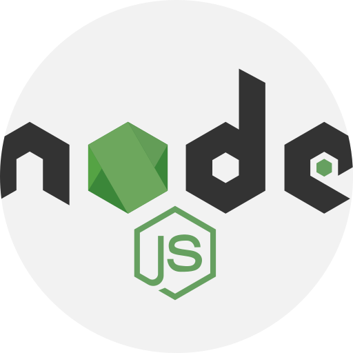

### Hi there 👋
#### If you like what I do, maybe consider buying me a coffee/tea 🥺👉👈

[](https://ko-fi.com/N4N74ADJR)


## ☕ About 

- 🚀  Full stack developer engineer at [TodayTix Group](https://www.todaytix.com/)
- 💻  [https://vianch.com](https://www.vianch.com/)
- 🐦  [Twitter](https://twitter.com/vianch_tog)
- 🔭  I’m currently working on VIANCH.COM blog
- 🌱  I’m currently learning and training LLM NLP models and datasets
- 🌱  I’m currently creating my 2023 portfolio
- 👯  I’m looking to collaborate on open software projects
- 💬  Ask me about anything you want
- 📫  How to reach me: [discord](https://discord.com/invite/UVgXjgEXX4)
- ⚡  🎮 Fun fact: Nintendo fanboy / 🐕 I have a dog called Mateo

##  📈  Weekly statistics


<!--START_SECTION:waka-->

```txt
TypeScript   11 hrs 42 mins        █████████████████▓░░░░░░░   70.48 %
Other        2 hrs 58 mins         ████▒░░░░░░░░░░░░░░░░░░░░   17.87 %
Markdown     51 mins               █▒░░░░░░░░░░░░░░░░░░░░░░░   05.19 %
Rust         23 mins               ▓░░░░░░░░░░░░░░░░░░░░░░░░   02.35 %
JavaScript   16 mins               ▒░░░░░░░░░░░░░░░░░░░░░░░░   01.61 %
```

<!--END_SECTION:waka-->

## 💻 Favorite tools

<div align="center">
     
 
</div>
